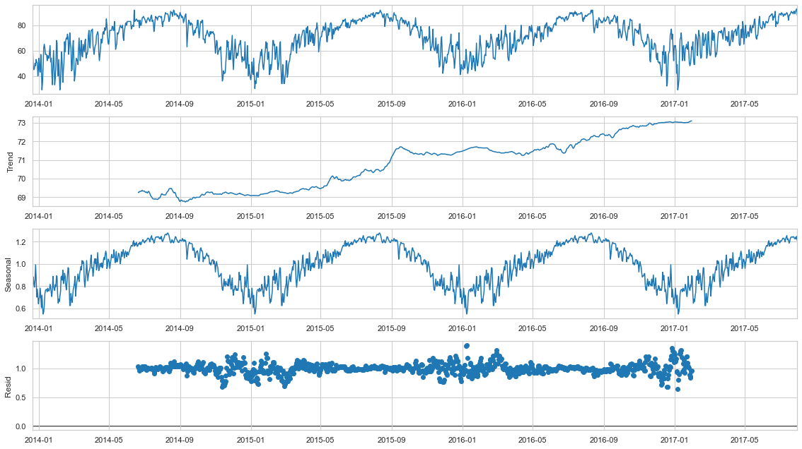
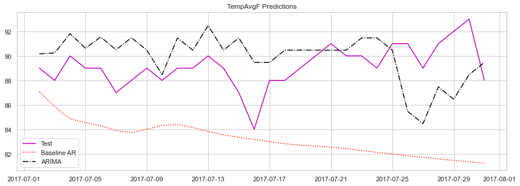
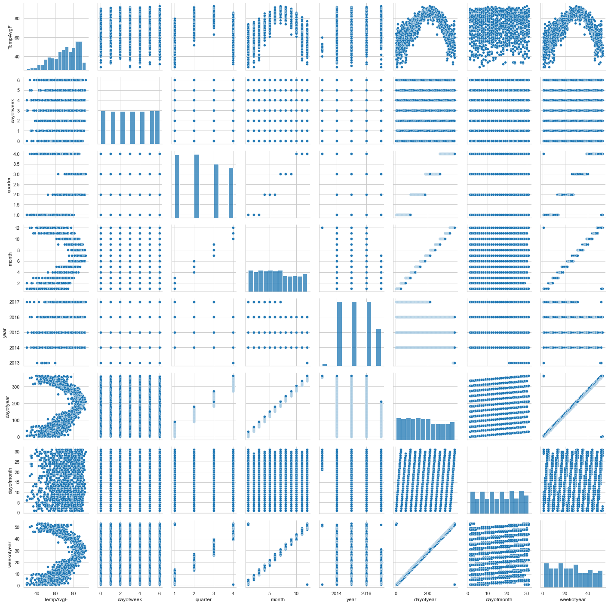
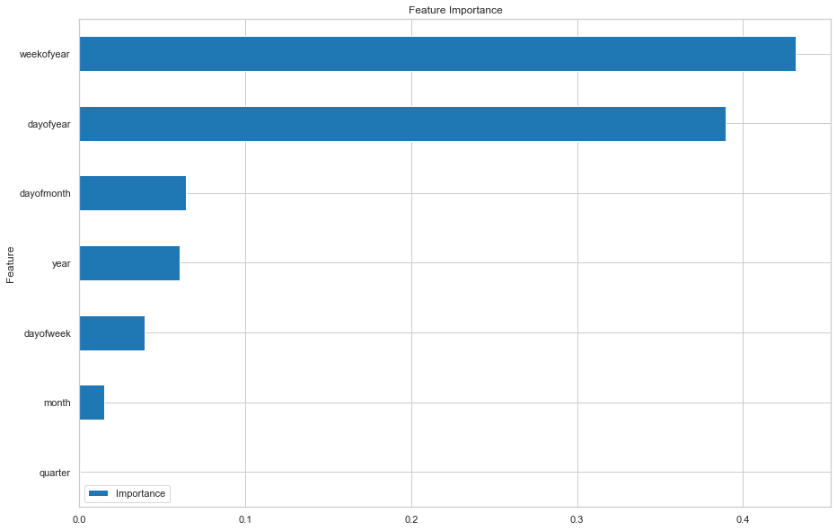

# TIME SERIES FORECAST WITH SCIKIT-LEARN

# 

# Table of Contents
1. Overview
2. Dataset
3. Baseline Model
4. ARIMA Model
5. Supervised Learning
6. Forecast
7. Future Work
8. References

# 

# 1. Overview

In this project we will use the [Austin Weather](https://www.kaggle.com/datasets/grubenm/austin-weather) dataset provided by [Kaggle](https://www.kaggle.com/) to forecast the average temperature in Austin Texas using SciKit-Learn.

We will divide the data in a training and test sets and train each model on the training set as follows:
* First we are going to make predictions using the AR model as a baseline over the raw data. 
* Afterward we are going to analyse the components of the time series in order to transform the data to apply the ARIMA model. 
* Using feature engineering we are going to prepare input data and use the time series as labels for a supervised machine learning model (random forest regressor).

Finally, we will compare a forecast made with each model for dates outside the dataset.

# 

# 2. Dataset
[Austin Weather](https://www.kaggle.com/datasets/grubenm/austin-weather): Historical temperature, precipitation, humidity, and windspeed for Austin, Texas


```python
# Import modules
import requests
import numpy as np
import pandas as pd
import seaborn as sns
import matplotlib.pyplot as plt

from statsmodels.tsa.ar_model import AutoReg
from statsmodels.tsa.stattools import adfuller
from statsmodels.graphics.tsaplots import plot_pacf, plot_acf
from statsmodels.tsa.seasonal import seasonal_decompose

from pmdarima import auto_arima

from sklearn.ensemble import RandomForestRegressor
from sklearn.metrics import mean_squared_error, mean_absolute_error, r2_score

# Seaborn theme
sns.set_theme(style="whitegrid", palette=None)
```


```python
# Load data
github_url = "https://raw.githubusercontent.com/Dieg0Maciel/time_series_forecast_with_scikitlearn/main/"
data_url = github_url + "austin_weather.csv"
data = pd.read_csv(data_url)

# Set "Date" as index and cast it as a datetime type
data = data.set_index("Date")
data.index = pd.to_datetime(data.index)

# Separate time series for the average temperature
y = pd.DataFrame(data["TempAvgF"].values, index=data.index, columns=["TempAvgF"])

# Average temperature plot
y.plot(figsize=(15, 5), title='Avg. Temperature in Farenheit')
plt.show()
```


    

    


# 3. Baseline AR Model


```python
# Train-test split
d = 30
y_train = y[:len(y) - d]
y_test = y[len(y) - d:]

# Baseline model training
ar_model = AutoReg(y_train, lags=10).fit()

# Predictions
y_base_pred = ar_model.predict(start=len(y_train), end=len(y)-1, dynamic=False)
```

    /home/diego/anaconda3/envs/ML/lib/python3.7/site-packages/statsmodels/tsa/base/tsa_model.py:471: ValueWarning: No frequency information was provided, so inferred frequency D will be used.
      self._init_dates(dates, freq)
    /home/diego/anaconda3/envs/ML/lib/python3.7/site-packages/statsmodels/tsa/deterministic.py:302: UserWarning: Only PeriodIndexes, DatetimeIndexes with a frequency set, RangesIndexes, and Index with a unit increment support extending. The index is set will contain the position relative to the data length.
      fcast_index = self._extend_index(index, steps, forecast_index)


```python
# Error metrics
rmse_base = np.sqrt(mean_squared_error(y_test, y_base_pred))
mae_base = mean_absolute_error(y_test, y_base_pred)
r2_base = r2_score(y_test, y_base_pred)

error_metrics = f"""
Error Metrics:
    * Root Mean Square Error: {rmse_base}
    * Mean Absolute Error: {mae_base}
    * R2 Score: {r2_base}
"""
print(error_metrics)

# Plot predictions vs test
plt.figure(figsize=(15,5))
plt.plot(y_test.index.values, y_test.T.values[0], 'm')
plt.plot(y_test.index.values, y_base_pred.T.values, ':r')
plt.legend(['Test','Baseline AR'])
plt.title("TempAvgF Predictions")
plt.show()
```

    
    Error Metrics:
        * Root Mean Square Error: 6.456988537590616
        * Mean Absolute Error: 5.942274646002439
        * R2 Score: -13.860764703809483
    


    

    


# 4. ARIMA model

### Time Series Components


```python
period = 365 # in days

"""Multiplicative Decomposition"""
multiplicative_decomposition = seasonal_decompose(
    y, model="multiplicative", period=period
)

fig = multiplicative_decomposition.plot()
fig.set_size_inches((16, 9))
fig.tight_layout()
plt.show()
```


    

    


From a visual inspection we can see an small upward trend and a yearly seasonality, thus this series is most likely not stationary

### Augmented Dickey Fuller Test
The presence of a unit root means the time series is non-stationary.

**Null hypothesis of the augmented Dickey-Fuller test**: *a unit root is present in a time series sample*.


```python
dickey_fuller_test = adfuller(y, autolag='AIC')
adf_results = f"""
Dickey-Fuller test:
    * ADF: {dickey_fuller_test[0]}
    * p-value: {dickey_fuller_test[1]}
    * number of lags: {dickey_fuller_test[2]}
    * number of observations: {dickey_fuller_test[3]}
    * critical values: {dickey_fuller_test[4]}
"""
print(adf_results)
```

    
    Dickey-Fuller test:
        * ADF: -2.498133353652842
        * p-value: 0.11592916083987015
        * number of lags: 13
        * number of observations: 1305
        * critical values: {'1%': -3.4353708501743654, '5%': -2.8637572934525286, '10%': -2.56795049999266}
    


Since the ADF value is greater than the critical value we maintain the null hypotesis of the Dickey-Fuller test and conclude that the series is not stationary

### Differencing

Diferencing consist in the transformation

$$ y_{\text{diff}}(t) = y(t) - y(t - \text{lag}) $$

the inverse transform is

$$ y(t) = y_{\text{diff}}(t) + y(t - \text{lag}) $$


```python
# We differencing with a time lag equal to the period
y_diff = y.diff(period).dropna()
y_diff.plot()
plt.show()

# We applay the ADF test once again
dickey_fuller_test = adfuller(y_diff, autolag='AIC')
adf_results = f"""
Dickey-Fuller test:
    * ADF: {dickey_fuller_test[0]}
    * p-value: {dickey_fuller_test[1]}
    * number of lags: {dickey_fuller_test[2]}
    * number of observations: {dickey_fuller_test[3]}
    * critical values: {dickey_fuller_test[4]}
"""
print(adf_results)
```


    

    


    
    Dickey-Fuller test:
        * ADF: -10.771843642222514
        * p-value: 2.3733029147105e-19
        * number of lags: 3
        * number of observations: 950
        * critical values: {'1%': -3.4372521657769353, '5%': -2.864587159166059, '10%': -2.5683924808864265}
    


Since the ADF value is smaller than the critical value we reject the null hypotesis of the Dickey-Fuller test and conclude that the series is trend stationary

### Autocorrelation and partial correlation


```python
plot_pacf(y_diff, lags=25, method='ywm')
plot_acf(y_diff, lags=25)
plt.show()
```


    

    


    

    


```python
# Train-test split
y_diff_train = y_diff[:len(y_diff) - d]
y_diff_test = y_diff[len(y_diff) - d:]

# Training
arima_model = auto_arima(y_diff_train, trace=True, supress_warnings=True)
arima_model.summary()
```

    Performing stepwise search to minimize aic
     ARIMA(2,0,2)(0,0,0)[0] intercept   : AIC=6208.579, Time=0.69 sec
     ARIMA(0,0,0)(0,0,0)[0] intercept   : AIC=6775.527, Time=0.03 sec
     ARIMA(1,0,0)(0,0,0)[0] intercept   : AIC=6267.279, Time=0.07 sec
     ARIMA(0,0,1)(0,0,0)[0] intercept   : AIC=6305.052, Time=0.11 sec
     ARIMA(0,0,0)(0,0,0)[0]             : AIC=6796.191, Time=0.02 sec
     ARIMA(1,0,2)(0,0,0)[0] intercept   : AIC=6208.464, Time=0.29 sec
     ARIMA(0,0,2)(0,0,0)[0] intercept   : AIC=6212.963, Time=0.18 sec
     ARIMA(1,0,1)(0,0,0)[0] intercept   : AIC=6208.108, Time=0.16 sec
     ARIMA(2,0,1)(0,0,0)[0] intercept   : AIC=6209.580, Time=0.27 sec
     ARIMA(2,0,0)(0,0,0)[0] intercept   : AIC=6217.740, Time=0.15 sec
     ARIMA(1,0,1)(0,0,0)[0]             : AIC=6212.530, Time=0.06 sec
    
    Best model:  ARIMA(1,0,1)(0,0,0)[0] intercept
    Total fit time: 2.070 seconds


<table class="simpletable">
<caption>SARIMAX Results</caption>
<tr>
  <th>Dep. Variable:</th>           <td>y</td>        <th>  No. Observations:  </th>    <td>924</td>   
</tr>
<tr>
  <th>Model:</th>           <td>SARIMAX(1, 0, 1)</td> <th>  Log Likelihood     </th> <td>-3100.054</td>
</tr>
<tr>
  <th>Date:</th>            <td>Fri, 22 Sep 2023</td> <th>  AIC                </th> <td>6208.108</td> 
</tr>
<tr>
  <th>Time:</th>                <td>13:58:13</td>     <th>  BIC                </th> <td>6227.423</td> 
</tr>
<tr>
  <th>Sample:</th>             <td>12-21-2014</td>    <th>  HQIC               </th> <td>6215.477</td> 
</tr>
<tr>
  <th></th>                   <td>- 07-01-2017</td>   <th>                     </th>     <td> </td>    
</tr>
<tr>
  <th>Covariance Type:</th>        <td>opg</td>       <th>                     </th>     <td> </td>    
</tr>
</table>
<table class="simpletable">
<tr>
      <td></td>         <th>coef</th>     <th>std err</th>      <th>z</th>      <th>P>|z|</th>  <th>[0.025</th>    <th>0.975]</th>  
</tr>
<tr>
  <th>intercept</th> <td>    0.8021</td> <td>    0.318</td> <td>    2.519</td> <td> 0.012</td> <td>    0.178</td> <td>    1.426</td>
</tr>
<tr>
  <th>ar.L1</th>     <td>    0.4534</td> <td>    0.037</td> <td>   12.134</td> <td> 0.000</td> <td>    0.380</td> <td>    0.527</td>
</tr>
<tr>
  <th>ma.L1</th>     <td>    0.3728</td> <td>    0.037</td> <td>    9.987</td> <td> 0.000</td> <td>    0.300</td> <td>    0.446</td>
</tr>
<tr>
  <th>sigma2</th>    <td>   48.0125</td> <td>    1.662</td> <td>   28.880</td> <td> 0.000</td> <td>   44.754</td> <td>   51.271</td>
</tr>
</table>
<table class="simpletable">
<tr>
  <th>Ljung-Box (L1) (Q):</th>     <td>0.00</td> <th>  Jarque-Bera (JB):  </th> <td>103.24</td>
</tr>
<tr>
  <th>Prob(Q):</th>                <td>0.96</td> <th>  Prob(JB):          </th>  <td>0.00</td> 
</tr>
<tr>
  <th>Heteroskedasticity (H):</th> <td>0.96</td> <th>  Skew:              </th>  <td>-0.03</td>
</tr>
<tr>
  <th>Prob(H) (two-sided):</th>    <td>0.74</td> <th>  Kurtosis:          </th>  <td>4.64</td> 
</tr>
</table><br/><br/>Warnings:<br/>[1] Covariance matrix calculated using the outer product of gradients (complex-step).


#### Python array slicing for the inverse differencing transform
Given the array

$v = [v[0],\cdots,v[i],\cdots,v[\text{len}(v)-1]]$

we can consider an index $j$ going from right to left such that
$$ v[i] = v[\text{len}(v)-1-j]\quad\Longrightarrow\quad i = \text{len}(v)-1-j $$
Consider the contiguous subarray of $v$ with lenght $d$

$$ v[k],\cdots,v[i] $$

the indices $k$ and $i$ satisfy the relation

$$ i - k = d - 1 $$

which leads to

$k = \text{len}(v)-j-d$

This allows us to write the subarray as

$v[\text{len}(v)-j-d],\cdots,v[\text{len}(v)-1-j ]$

Using Python slicing we can write the subarray as

$\text{subarray} = v[\text{len}(v)-j-d:\text{len}(v)-j ]$

or equivalently

$\text{subarray} = v[-(j+1+d):-(j+1) ]$

Considering $period=j+1+d$ leads to

$\text{subarray} = v[-period:-period+d ]$


```python
# Predictions
y_diff_pred = arima_model.predict(d)
y_pred = y_diff_pred.values + (y_train[-period:-period+d].T).values
y_pred = pd.DataFrame(y_pred.T, index=y_test.index,columns=y_test.columns)

# Error metrics
rmse = np.sqrt(mean_squared_error(y_test, y_pred))
mae = mean_absolute_error(y_test, y_pred)
r2 = r2_score(y_test, y_pred)

error_metrics = f"""
Error Metrics:
    * Root Mean Square Error: {rmse}
    * Mean Absolute Error: {mae}
    * R2 Score: {r2}
"""
print(error_metrics)

# Plot
plt.figure(figsize=(15,5))
plt.plot(y_test.index.values, y_test.T.values[0], 'm')
plt.plot(y_test.index.values, y_base_pred.T.values, ':r')
plt.plot(y_test.index.values, y_pred.T.values[0], '-.k')
plt.legend(['Test','Baseline AR','ARIMA'])
plt.title("TempAvgF Predictions")
plt.show()
```

    
    Error Metrics:
        * Root Mean Square Error: 2.8777919507487058
        * Mean Absolute Error: 2.4195359434647665
        * R2 Score: -1.9518882616295588
    


    

    


# 5. Supervised Learning


```python
"""
Create time series features based on time series index.
"""
df = y.copy()
df['dayofweek'] = df.index.dayofweek
df['quarter'] = df.index.quarter
df['month'] = df.index.month
df['year'] = df.index.year
df['dayofyear'] = df.index.dayofyear
df['dayofmonth'] = df.index.day
df['weekofyear'] = df.index.isocalendar().week
```


```python
"""
Heatmap
"""
plt.figure(figsize=(10,10))
sns.heatmap(df.corr(), annot=True)
plt.show()
```


    

    


```python
""" Scatterplots """
g = sns.PairGrid(df)
g.map_diag(sns.histplot)
g.map_offdiag(sns.scatterplot)
plt.show()
```


    

    


```python
""" Boxplots """
cols = ['TempAvgF', 'dayofweek', 'quarter', 'month', 'dayofyear', 'dayofmonth', 'weekofyear']
plt.figure(figsize=(15,15))
sns.boxplot(data=df[cols], orient="h")
plt.show()
```


    

    


```python
# Train-test split

train = df.loc[df.index < y_test.index[0]]
test = df.loc[df.index >= y_test.index[0]]

FEATURES = [
    'dayofweek', 'quarter', 'month', 'year', 'dayofyear', 'dayofmonth', 'weekofyear'
]
TARGET = 'TempAvgF'

X_train = train[FEATURES]
Y_train = train[TARGET]

X_test = test[FEATURES]
Y_test = test[TARGET]
```


```python
""" Model"""
# Random Forest
rforest_reg = RandomForestRegressor()
rforest_reg.fit(X_train, Y_train)
```


    RandomForestRegressor()


```python
""" Feature importance"""

df_importance = pd.DataFrame(
    {'Feature': X_train.columns.values,
    'Importance': rforest_reg.feature_importances_}
)

df_importance = df_importance.set_index("Feature")

df_importance.sort_values('Importance').plot(
    kind='barh', title='Feature Importance', figsize=(15,10)
)
plt.show()
```


    

    


```python
"""Predictions"""
predictions = rforest_reg.predict(X_test)
Y_pred = pd.DataFrame(data=predictions, index=y_test.index, columns=['Predictions'])
```


```python
# Error metrics
rmse_rfr = np.sqrt(mean_squared_error(Y_test.values, Y_pred.values))
mae_rfr = mean_absolute_error(Y_test.values, Y_pred.values)
r2_rfr = r2_score(Y_test.values, Y_pred.values)

error_metrics = f"""
Error Metrics:
    * Root Mean Square Error: {rmse_rfr}
    * Mean Absolute Error: {mae_rfr}
    * R2 Score: {r2_rfr}
"""
print(error_metrics)

# Plot
plt.figure(figsize=(15,5))
plt.plot(y_test.index.values, y_test.T.values[0], 'm')
plt.plot(y_test.index.values, y_base_pred.T.values, ':r')
plt.plot(y_test.index.values, y_pred.T.values[0], '-.k')
plt.plot(y_test.index.values, Y_pred.T.values[0], '--b')
plt.legend(['Test','Baseline AR','ARIMA', 'RandomForestRegressor'])
plt.title("TempAvgF Predictions")
plt.show()
```

    
    Error Metrics:
        * Root Mean Square Error: 2.633892556654503
        * Mean Absolute Error: 1.8749999999999991
        * R2 Score: -1.472733069306928
    


    

    


We can see that the supervised learning model performs really well compared to the autoregression models.

# 6. Forecast


```python
X = df[FEATURES]
Y = df[TARGET]
```


```python
# Training on the entire series
ar_model = AutoReg(y, lags=10).fit()
arima_model = auto_arima(y_diff, trace=True, supress_warnings=True)
rforest_reg.fit(X, Y)
```

    /home/diego/anaconda3/envs/ML/lib/python3.7/site-packages/statsmodels/tsa/base/tsa_model.py:471: ValueWarning: No frequency information was provided, so inferred frequency D will be used.
      self._init_dates(dates, freq)


    Performing stepwise search to minimize aic
     ARIMA(2,0,2)(0,0,0)[0] intercept   : AIC=6381.536, Time=0.54 sec
     ARIMA(0,0,0)(0,0,0)[0] intercept   : AIC=6967.704, Time=0.03 sec
     ARIMA(1,0,0)(0,0,0)[0] intercept   : AIC=6442.367, Time=0.08 sec
     ARIMA(0,0,1)(0,0,0)[0] intercept   : AIC=6481.523, Time=0.13 sec
     ARIMA(0,0,0)(0,0,0)[0]             : AIC=6989.098, Time=0.02 sec
     ARIMA(1,0,2)(0,0,0)[0] intercept   : AIC=6381.541, Time=0.37 sec
     ARIMA(2,0,1)(0,0,0)[0] intercept   : AIC=6382.671, Time=0.33 sec
     ARIMA(3,0,2)(0,0,0)[0] intercept   : AIC=6373.749, Time=0.62 sec
     ARIMA(3,0,1)(0,0,0)[0] intercept   : AIC=6372.123, Time=0.56 sec
     ARIMA(3,0,0)(0,0,0)[0] intercept   : AIC=6375.177, Time=0.18 sec
     ARIMA(4,0,1)(0,0,0)[0] intercept   : AIC=6373.802, Time=1.32 sec
     ARIMA(2,0,0)(0,0,0)[0] intercept   : AIC=6391.203, Time=0.16 sec
     ARIMA(4,0,0)(0,0,0)[0] intercept   : AIC=6372.108, Time=0.36 sec
     ARIMA(5,0,0)(0,0,0)[0] intercept   : AIC=6373.831, Time=0.30 sec
     ARIMA(5,0,1)(0,0,0)[0] intercept   : AIC=6375.798, Time=1.28 sec
     ARIMA(4,0,0)(0,0,0)[0]             : AIC=6374.992, Time=0.11 sec
    
    Best model:  ARIMA(4,0,0)(0,0,0)[0] intercept
    Total fit time: 6.403 seconds


    RandomForestRegressor()


```python
# AR Forecast
d = 30
y_ar_forecast = ar_model.predict(start=len(y)+1, end=len(y)+d, dynamic=False)
```

    /home/diego/anaconda3/envs/ML/lib/python3.7/site-packages/statsmodels/tsa/deterministic.py:302: UserWarning: Only PeriodIndexes, DatetimeIndexes with a frequency set, RangesIndexes, and Index with a unit increment support extending. The index is set will contain the position relative to the data length.
      fcast_index = self._extend_index(index, steps, forecast_index)


```python
# ARIMA Forecast
y_arima_forecast = arima_model.predict(d)

# Inverse transform
y_diff_forecast = arima_model.predict(d)
y_arima_forecast = y_diff_forecast.values + (y[-period:-period+d].T).values
y_arima_forecast = pd.DataFrame(
    y_arima_forecast.T, index=y_diff_forecast.index, columns=y_diff.columns
)
```


```python
#Create RandomForestRegressor Forecast imputs.
X_forecast = pd.DataFrame()
X_forecast.index = y_arima_forecast.index
X_forecast['dayofweek'] = y_arima_forecast.index.dayofweek
X_forecast['quarter'] = y_arima_forecast.index.quarter
X_forecast['month'] = y_arima_forecast.index.month
X_forecast['year'] = y_arima_forecast.index.year
X_forecast['dayofyear'] = y_arima_forecast.index.dayofyear
X_forecast['dayofmonth'] = y_arima_forecast.index.day
X_forecast['weekofyear'] = y_arima_forecast.index.isocalendar().week

# RandomForestRegressor Forecast
Y_rfr_forecast = rforest_reg.predict(X_forecast)
```


```python
# Plot forecast
plt.figure(figsize=(15,5))
plt.plot(y_ar_forecast.index, y_ar_forecast.T.values, ':r')
plt.plot(y_ar_forecast.index, y_arima_forecast.T.values[0], '-.k')
plt.plot(y_ar_forecast.index, Y_rfr_forecast, '--b')
plt.legend(['Baseline AR', 'ARIMA', 'RandomForestRegressor'])
plt.title("TempAvgF Forecast")
plt.show()
```


    

    


# 7. Future Work
* We can extend this dataset or create a dataset for another city using a weather API like [Weather API](https://www.weatherapi.com/) following the steps from the previous project [ETL PIPELINE WITH PYTHON AND AIRFLOW](https://github.com/Dieg0Maciel/etl_pipeline_with_python_and_airflow) where we studied how to build a pipeline in order to manipulate weather forecast data provided by the [Open Weather](https://openweathermap.org/) API. 

# 

## 8. REFERENCES
* [Peter Kempthorne, *Time Series Analysis I*](https://www.youtube.com/watch?v=uBeM1FUk4Ps)
* [Spencer Hayes, *Finding Seasonal Trends in Time-Series Data with Python*](https://towardsdatascience.com/finding-seasonal-trends-in-time-series-data-with-python-ce10c37aa861)
* [Mukesh Chaudhary, *Why is Augmented Dickey–Fuller test (ADF Test) so important in Time Series Analysis*](https://medium.com/@cmukesh8688/why-is-augmented-dickey-fuller-test-adf-test-so-important-in-time-series-analysis-6fc97c6be2f0)
* [Brendan Artley, *Time Series Forecasting with ARIMA , SARIMA and SARIMAX*](https://towardsdatascience.com/time-series-forecasting-with-arima-sarima-and-sarimax-ee61099e78f6)
* [Nachiketa Hebbar, *Time Series Forecasting*](https://www.youtube.com/playlist?list=PLqYFiz7NM_SMC4ZgXplbreXlRY4Jf4zBP)
* [Rob Mulla, *Time Series Forecasting with Machine Learning [YT]*](https://www.kaggle.com/code/robikscube/time-series-forecasting-with-machine-learning-yt)
* [Moez Ali, *Time Series Forecasting Tutorial*](https://www.datacamp.com/tutorial/tutorial-time-series-forecasting)
